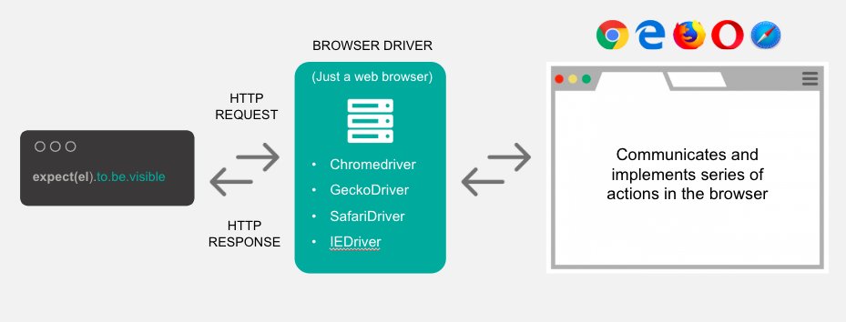
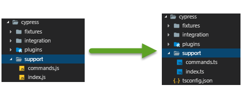
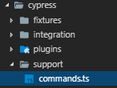
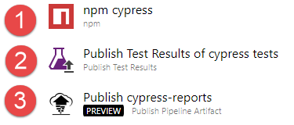

From Basic to Advanced Testing

Note: [cypress.io](https://www.cypress.io/)

<!--s-->

# Program

- What is Cypress?
- Project Setup strategies
- Taking shortcuts
- Vue Component Testing
- CI/CD
- Showcase

<!--s-->

# What is Cypress

 <!-- .element style="border: 0; background: None; box-shadow: None" width="100px" -->

<!--v-->

- Javascript E2E, Unit & Integratie Testing framework
- Made for everything in the <span class="bright"> browser </span>
- For Developers & QA Engineers

<!--v-->

## All-in-one Test Library

<!--v-->

Bundled Tools:

- Mocha
- Chai
- Sinon
- Sinon-Chai

Note: [Bundled Tools](https://docs.cypress.io/guides/references/bundled-tools.html)
TODO: Convert to logo's

<!--v-->

Default Utility libraries:

- lodash
- jQuery
- minimatch.js
- moment.js
- blob utils
- Promise (Bluebird)

Note: [Utilities](https://docs.cypress.io/guides/references/bundled-tools.html#Other-Library-Utilities)
TODO: Convert to logo's

<!--v-->

## How?

<!--v-->


<!--v-->

<ul>
  <li class="fragment fade-in-then-semi-out"><p>Runs fully in the browser</p></li>
  <li class="fragment fade-in-then-semi-out">
    <p>Full control of</p>
    <ul>
      <li><p>Network trafic</p></li>
      <li><p>Local storage/cookies</p></li>
      <li><p>Applicatie started</p></li>
      <li><p>...</p></li>
    </ul>
  </li>
  <li class="fragment fade-in-then-semi-out">
    <p>All tests written in JS/TS</p>
  </li>
</ul>

Note: [Cypress architecture](https://docs.cypress.io/guides/overview/key-differences.html#Architecture)
[How it works](https://www.cypress.io/how-it-works/)

<!--v-->

## Browser support

<!--v-->

<div class="image-box">
  
  
  
</div>

Custom browser can be added like e.g. Brave <!-- .element class="bottom-note fragment" -->

Note: [Cypress Browser Support](https://docs.cypress.io/guides/guides/launching-browsers.html#Browsers)

<!--s-->

# Project Setup strategies

 <!-- .element style="border: 0; background: None; box-shadow: None" width="100px" -->

<!--v-->

## First things first

- Language choise <!-- .element class="fragment fade-in-then-semi-out" -->
- Stand alone or integrated <!-- .element class="fragment fade-in-then-semi-out" -->

Note:
[TS support](https://docs.cypress.io/guides/tooling/typescript-support.html#Install-TypeScript)
[Install Cypress](https://docs.cypress.io/guides/getting-started/installing-cypress.html)

<!--v-->

## Demo

<!--v-->

## Basic

```TS [2|4-5|7|8|10-14]
 it('It should go through the intro flow', () => {
    cy.visit('nl/Opstart Eenmanszaak');

    cy.get('#ccc-notify-accept').click();
    cy.get('.xer-mb-3').click();

    cy.getBy('xer-sync-point');
    cy.get('div.xer-flex > .xer-btn').click();

    cy.getBy('xer-sync-point');
    cy.get('#persoon\\.voornaam').type('John');
    cy.get('.xer-btn')
      .first()
      .click();
  });
```

<!--v-->

### Maintenance issues

- Use of Ids and CSS selectors <!-- .element class="fragment fade-in-then-semi-out" -->
- Repeating functional behavior <!-- .element class="fragment fade-in-then-semi-out" -->

Note:

- CSS and id selectors can change without a functional change
- The same functional block have different selector approaches (e.g. Next buttons)

<!--v-->

## Automation Ids

<!-- prettier-ignore -->
```html [|3,8]
<input 
  id="Voornaam" 
  data-cy="my-input" 
  type="text" />

<button
  id="next-button"
  data-cy="next">
    Next Step
</button>
```

- Custom attribute for automation <!-- .element class="fragment fade-in-then-semi-out" -->
- Only changes if functionality changes <!-- .element class="fragment fade-in-then-semi-out" -->

Note:
[Best practices - Selecting Elements](https://docs.cypress.io/guides/references/best-practices.html#Selecting-Elements)

<!--v-->

### Cypress Command

```TS []
// support/commands.ts
...
const dataAutomationIdAttr = 'data-automation-id';

function getBy(
  automationId: string,
  options?: Partial<Cypress.Loggable & Cypress.Timeoutable & Cypress.Withinable> | undefined
) {
  return cy.get(`[${dataAutomationIdAttr}="${automationId}"]`, options);
}
...
```

<!--v-->

### Updated test file

```TS [|4|5,8,12|11]
it('It should go through the intro flow - Result', () => {
    cy.visit('nl/Opstart Eenmanszaak');

    cy.get('#ccc-notify-accept').click();
    cy.getBy('navigatie-verder').click();

    cy.getBy('xer-sync-point');
    cy.getBy('navigatie-verder').click();

    cy.getBy('xer-sync-point');
    cy.getBy('textfield_input').type('John');
    cy.getBy('navigatie-verder')
      .first()
      .click();
  });
```

<!--v-->

## Centralize Selectors

- Functional Readability <!-- .element class="fragment fade-in-then-semi-out" -->
- Improve Maintenance <!-- .element class="fragment fade-in-then-semi-out" -->

Note:

- Centralize based on components
- find repeatable elements

<!--v-->

### Cookie Control


<!--v-->

### Start aanbod


<!--v-->

### Verder zonder itsme


<!--v-->

### input


<!--v-->

### component selectors

```TS [|4-6|7|8|9-12|13|14]
// support/component.selectors.ts

export const componentSelectors = {
  cookieControl: {
    acceptButton: () => cy.get('#ccc-notify-accept')
  },
  startAanbodButton: () => cy.getBy('navigatie-verder'),
  verderZonderItsm: () => cy.getBy('navigatie-verder'),
  xerInput: {
    input: () => cy.getBy('textfield_input'),
    errorMessage: () => cy.getBy('textfield_error'),
  },
  verder: () => cy.getBy('navigatie-verder').first(),
  syncPoint: () => cy.getBy('xer-sync-point')
};
```

<!--v-->

### Updated test file

```TS [|4|5,8,12|11]
it('It should go through the intro flow - Result', () => {
  cy.visit('nl/Opstart Eenmanszaak');

  componentSelectors.cookieControl.acceptButton().click();
  componentSelectors.verder().click();

  componentSelectors.syncPoint();
  componentSelectors.verder().click();

  componentSelectors.syncPoint();
  componentSelectors.xerInput.input().type('John');
  componentSelectors.verder().click();
});
```

<!--v-->

## Centralize behavior

- Focus on functional component behavior <!-- .element class="fragment fade-in-then-semi-out" -->
- Improves maintainability <!-- .element class="fragment fade-in-then-semi-out" -->

Note:

- Maintenance will highly improve depending of the reusability of you support components

<!--v-->

### Context


<!--v-->

## What to choose?

- depends on:
  - Scale <!-- .element class="fragment fade-in-then-semi-out" -->
  - Component Architecture <!-- .element class="fragment fade-in-then-semi-out" -->
  - Application Flow <!-- .element class="fragment fade-in-then-semi-out" -->

<!--s-->

# Shortcuts

 <!-- .element style="border: 0; background: None; box-shadow: None" width="100px" -->

<!--v-->

## Skip login flows

<!--v-->

## Preset application state

<!--v-->

## Test Aware Development

- Think how you are gonne automate this
- provide shortcuts to cut external software e.g. payments
- All to make sure your critical path is fully automated

<!--s-->

## Vue Component Testing

 <!-- .element style="border: 0; background: None; box-shadow: None" width="100px" -->

<!--v-->

Take test your compontens in a real browser

<!--v-->

## Demo

<!--s-->

# CI/CD

 <!-- .element style="border: 0; background: None; box-shadow: None" width="100px" -->

<!--v-->

## PR Flow

<!--v-->

## E2E Regression flow

<!--v-->

## Scaling up

- parallelize your tests with different commands in parallel jobs

## Multi browser target

- docker

// TODO: Add Note

<!--s-->

# Showcase

 <!-- .element style="border: 0; background: None; box-shadow: None" width="100px" -->

<!--s-->

# Technisch

<!--v-->

## Agenda

- Technisch
  - Werking
  - Installatie
  - Test mogelijkheden
  - CI

<!--s-->

## Werking

<!--v-->

### Selenium



- Werkt buiten de browser
- Voert commands uit via netwerk

Note: [source](https://applitools.com/blog/cypress-vs-selenium-webdriver-better-or-just-different)

<!--v-->

### Cypress


<!--s-->

## Installatie

Note: [Installatie](https://docs.cypress.io/guides/getting-started/installing-cypress.html)

<!--v-->

## Cypress

```bash
  npm install cypress --save-dev
```

### Commands

```json [5-6]
// package.json

"scripts": {
  ...
  "cy-open": "cypress open",
  "cy-run": "cypress run",
}
```

<!--v-->

## Typescript support

File Preprocessor

```bash
npm install @bahmutov/add-typescript-to-cypress --save-dev
```

TSCONFIG

```json
// cypress/.tsconfig
{
  "extends": "../tsconfig",
  "compilerOptions": {
    "baseUrl": "../node_modules",
    "target": "es5",
    "lib": ["es5", "dom"],
    "types": ["cypress"]
  },
  "include": ["**/*.ts"]
}
```

Note: [Typescript support](https://docs.cypress.io/guides/tooling/typescript-support.html#Transpiling-TypeScript-test-files)

<!--v-->

Update Support files



Update config

```json
// cypress.json
...
"supportFile": "./cypress/support/index.ts",
...
```

<!--s-->

## Test mogelijkheden

<!--v-->

### All-in-one Test Library

standaard ondersteuning voor:

- Mocha
- Chai
- Sinon
- Sinon-Chai

Note: [Bundled Tools](https://docs.cypress.io/guides/references/bundled-tools.html)

<!--v-->

Standaard Utility libraries:

- lodash
- jQuery
- minimatch.js
- moment.js
- blob utils

Note: [Utilities](https://docs.cypress.io/guides/references/bundled-tools.html#Other-Library-Utilities)

<!--v-->

## Demo

```bash
git checkout cypress-talk/writing-tests-demo-0
npm run demo
```

Note: http://localhost:4202

<!--v-->

```Typescript
describe('collapse component', () => {
  beforeEach(() => {
    cy.visit('');
  });

  it('Should show the collapse body when the header is clicked', () => {
    // Act
    cy.get('[data-cy=profiel-header]').click();

    // Assert
    cy.get('[data-cy=profiel-body]').should('be.visible');
  });

  it('Should hide the collapse body when the header is clicked', () => {
    // Arrange
    cy.get('[data-cy=profiel-header]').click();

    // Act
    cy.get('[data-cy=profiel-header]').click();

    // Assert
    cy.get('[data-cy=profiel-body]').should('not.exist');
  });
});
```

<!--v-->

## Custom Commands

<!--v-->

## Demo

```bash
git checkout cypress-talk/writing-tests-demo-1
npm run demo
```

<!--v-->



GetBy (data-cy attribute)

```Typescript
// commands.ts
...
function getBy(cyName: string): Cypress.Chainable<JQuery> {
  return cy.get(`[data-cy=${cyName}]`);
}
...
```

<!--v-->

## Register command

```typescript
// commands.ts

// Define the function on type for intelliSense to find it
declare namespace Cypress {
  interface Chainable<Subject> {
    getBy: typeof getBy;
  }
}

function getBy(cyName: string): Cypress.Chainable<JQuery> {
  return cy.get(`[data-cy=${cyName}]`);
}

// Add the function as custom Command
Cypress.Commands.add("getBy", getBy);
```

<!--v-->

## Route Check <!-- & Stubbing -->

<!--v-->

## Demo

<a target="_blank" href="http://ta-zeno.xeriusgroup.be">Zeno</a>

```bash
git checkout cypress-talk/route-checking
npm run demo
```

<!--v-->

```Typescript
describe('Zeno - Identificatie Lei entiteit', () => {
  describe('selectie functiehouder', () => {
    beforeEach(() => {
      cy.server(); // Start server
      cy.route({
        method: 'POST',
        url: '/*/IdentificatieLeiEntiteit/KboRaadplegen**',
        status: 200
      }).as('kboRaadplegen'); // Define route to watch for

      cy.visit('http://ta-zeno.xeriusgroup.be/');
      cy.get('[data-automation-id="Z-Index-a-636761615049713107"]').click();
    });

    it('Identifie met KBO nummer als bevoegde met functiehouders should only show functiehouder selectie', () => {
      cy.get('#ondernemingsnummer').type('0700278137');
      cy.get('#btn-kbo-raadplegen')
        .click()
        .wait('@kboRaadplegen'); //Wait and check for a completed call

      cy.getBy('aanvrager-type-bevoegd').click();

      cy.get('#aanvrager-functiehouder').should('be.visible');
    });
  });
});
```

Note: [Routes](https://docs.cypress.io/api/commands/route.html)

<!--v-->

## Local Storage/Cookie Preset

<!--v-->

## Demo

```bash
git checkout cypress-talk/cookie-demo
npm run demo
```

<!--v-->

```Typescript
describe('Login to my xerius desk', () => {
  beforeEach(() => {
    // Reset before each run
    cy.clearLocalStorage();
    cy.clearCookies();
  });

  it('Open Xerius Desk as al@vidam.be without login', () => {
    cy.setCookie(
      'XeriusPartnerPortal',
      'E-8ZRhvmNubY...',
      { domain: 'acc-desk.xerius.be' }
    );
    cy.setCookie('idsrvlanguagecookie', 'nl-BE', { domain: 'acc-desk.xerius.be' });

    cy.visit('https://acc-desk.xerius.be');
  });
});

```

<!--v-->

## Application manipulation

<!--v-->

## Demo

```bash
git checkout cypress-talk/application-manipulation
npm run demo
```

<!--v-->

Test

```Typescript
describe('Persoonsgegevens', () => {
    let store: Store;
    beforeEach(() => {
      cy.visit('');
      cy.window().then(win => {
        // Get exposed angular services from window
        store = (win as any).ngServices.store;
      });
    });

    it('It should show the current persoonsgegevens when clicking the user btn', () => {
      const persoonsgegevens = {
        voornaam: 'appel',
        naam: 'boom',
        email: 'appel.boom@fruit.be'
      };

      store.reset({
        ...
      });

      cy.getBy('btn-profiel').click();

      cy.get('.naam').should('have.value', persoonsgegevens.naam);
      cy.getBy('voornaam').should('have.value', persoonsgegevens.voornaam);
      cy.get('.email').should('have.value', persoonsgegevens.email);
    });
  });
```

<!--v-->

Expose services

```Typescript
// app.component.ts

@Component({
  selector: 'xer-root',
  templateUrl: './app.component.html'
})
export class AppComponent implements OnDestroy {
  constructor(
    store: Store,
    ...
  ) {
    ...

    exposeE2eTestingServices({ store });
  }
}
```

<!--v-->

exposeE2eTestingServices

```Ts
import { environment } from '@xer-environment';
import { ExposedE2eServicesModel } from './models/exposed-e2e-services.model';

export function exposeE2eTestingServices(exposedServices: ExposedE2eServicesModel) {
  if (environment.exposeE2eTestingServices) {
    (window as any).ngServices = exposedServices;
  }
}

```

<!--s-->

## Continuous Integration

Bruto-Netto

<!--v-->

## Doel

- UI tests uitvoeren voor code in PR
- Test resultaten importeren
- Screenshots/recordings uploaden

<!--v-->

## praktisch

- Testen uitvoeren als deel van de pipe
- Op een productie build
- Zonder afzonderlijke server deploy
- Gebruik dev API

⚠️Geen blijvende data manipulatie uitvoeren ⚠️<!-- .element: class="fragment" -->

Note: ideaal voor compoment testing

<!--v-->

## Productie build

Voorzien van "cypress" build configuratie die:

- Productie build maakt
- Standaard connectie naar bv. dev omgeving APIs
- Afzonderlijke output folder

```json
// package.json - scripts

"start-cy": "ng serve --configuration=cy",
...
"build-cy": "npm run build -- --configuration=cy",

```

Note: Afzonderlijke map zodat deze niet wordt gebundeld als artifact van een build.

<!--v-->

## Lokale http-server

### Installatie

```bash
npm install http-server --save-dev
```

### script

```json
// package.json - scripts

 "start-ci": "http-server <your-output-dir> -a localhost -p 4202 -c-1",
```

Note: [http-server](https://github.com/indexzero/http-server)

<!--v-->

## Huidige Commands

```JS
// package.json - scripts

// Create production build with Cypress environment configuration
"build-cy": "npm run build -- --configuration=cy",

// Start a local http server serving the build-cy output
"start-ci": "http-server <your-output-dir> -a localhost -p 4202 -c-1",

// Run cypress tests headless
"cy-run": "cypress run",

```

<!--v-->

## Running Parallel Commands

```bash
npm install npm-run-all --save-dev
```

### cy-ci

```JS
"cy-ci": "npm run build-cy && npm run cy-verify && run-p --race start-ci cy-run"

/*
  1. npm run build-cy   => create build-cy output
  2. npm run cy-verify  => verify cypress installation (as CI installs this for the first time)
  3. run-p              => run the following commands in paralell
    start-ci      => start application cy build on local http-server
    cy-run        => run cypress tests
    --race        => Terminate all tasks when one finishes
*/
```

<!--v-->

## VSTS BUILD



1. Run **npm run cy-ci**
2. Publish JUnit test results
3. Publish Screenshots/recordings

<a target="_blank" href="https://xeriusit.visualstudio.com/SVZ-OL/_build/results?buildId=69313">Bruto-Netto build</a>

<style>

.image-box {
  display: flex; 
  justify-content: space-between;
}

.image-box img {
  height: 250px;
  margin: 10px;
}

.bottom-note {
  margin-top: 4em !important;
  font-size: 0.8em;
}

.bright {
  color: rgb(120, 217, 46);
}

#left {
	margin: 10px 0 15px 20px;
	text-align: center;
	float: left;
	z-index:-10;
	width:48%;
	font-size: 0.85em;
	line-height: 1.5;
}

#right {
	margin: 10px 0 15px 0;
	float: right;
	text-align: center;
	z-index:-10;
	width:48%;
	font-size: 0.85em;
	line-height: 1.5;
}

.reveal h1 {
  font-size: 2em !important;
}
</style>
