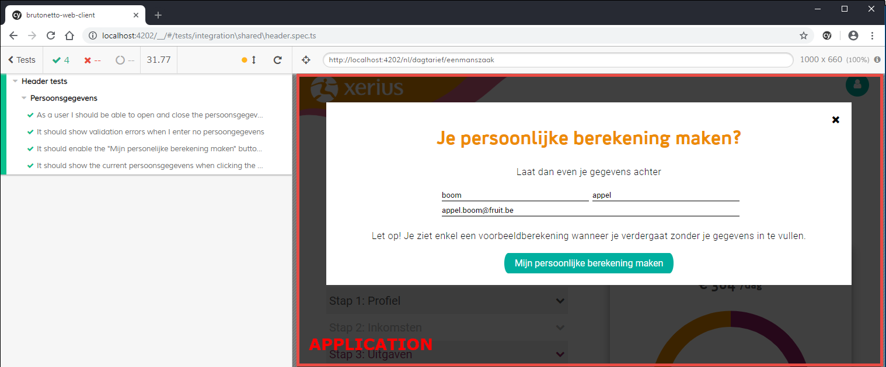

From Basic to Advanced Testing

Note: [cypress.io](https://www.cypress.io/)

<!--s-->


## Thomas De Pauw

<ul>
  <li class="fragment">Front-end Developer <span class="bright">@Euricom</span></li>
  <li class="fragment">VueJS = ❤️</li>
  <li class="fragment"> Passion to automate and optimize my workflow</li>
</ul>

<!--s-->

# Program

- What is Cypress? <!-- .element class="fragment fade-in-then-semi-out" -->
- Project Setup strategies <!-- .element class="fragment fade-in-then-semi-out" -->
- Shortcuts <!-- .element class="fragment fade-in-then-semi-out" -->
- CI/CD <!-- .element class="fragment fade-in-then-semi-out" -->
- Developer Involvement <!-- .element class="fragment fade-in-then-semi-out" -->

<!--s-->

# What is Cypress

 <!-- .element style="border: 0; background: None; box-shadow: None" width="100px" -->

<!--v-->

## Core

<ul>
  <li class="fragment fade-in-then-semi-out"><span class="bright">Javascript</span> E2E, Unit & Integratie Testing framework</li>
  <li class="fragment fade-in-then-semi-out">Made for everything in the <span class="bright"> browser </span></li>
  <li class="fragment fade-in-then-semi-out">For Developers & QA Engineers</li>
  <li class="fragment fade-in-then-semi-out">Open source & Free</li>
</ul>

<!--v-->

## All-in-one Test Library

<!--v-->

Bundled Tools:

- Mocha
- Chai
- Sinon
- Sinon-Chai

Note: [Bundled Tools](https://docs.cypress.io/guides/references/bundled-tools.html)
TODO: Convert to logo's

<!--v-->

Default Utility libraries:

- lodash
- jQuery
- minimatch.js
- moment.js
- blob utils
- Promise (Bluebird)

Note: [Utilities](https://docs.cypress.io/guides/references/bundled-tools.html#Other-Library-Utilities)
TODO: Convert to logo's

<!--v-->

## How does it run?

<!--v-->



<!--v-->

<ul>
  <li class="fragment fade-in-then-semi-out"><p>Runs fully in the browser</p></li>
  <li class="fragment fade-in-then-semi-out">
    <p>Full control of</p>
    <ul>
      <li><p>Network trafic</p></li>
      <li><p>Local storage/cookies</p></li>
      <li><p>Application state</p></li>
      <li><p>...</p></li>
    </ul>
  </li>
  <li class="fragment fade-in-then-semi-out">
    <p>All tests written in JS/TS</p>
  </li>
</ul>

Note: [Cypress architecture](https://docs.cypress.io/guides/overview/key-differences.html#Architecture)
[How it works](https://www.cypress.io/how-it-works/)

<!--v-->

## Browser support

<!--v-->

<div class="image-box">
  
  
  
</div>

<div class="bottom-note fragment">
Custom browser can be added like e.g.
  <div class="image-box image-box--center" style="height: 100px;">
    
    
  </div>
</div>

Note: [Cypress Browser Support](https://docs.cypress.io/guides/guides/launching-browsers.html#Browsers)

<!--s-->

# Project Setup strategies

 <!-- .element style="border: 0; background: None; box-shadow: None" width="100px" -->

<!--v-->

## First things first

- Language choise <!-- .element class="fragment fade-in-then-semi-out" -->
- Stand alone or integrated <!-- .element class="fragment fade-in-then-semi-out" -->

Note:
[TS support](https://docs.cypress.io/guides/tooling/typescript-support.html#Install-TypeScript)
[Install Cypress](https://docs.cypress.io/guides/getting-started/installing-cypress.html)

<!--v-->

## Demo

Note:
Highlight

- Selector playground
- Step by Step inspection
- Pauze feature

<!--v-->

## Basic

```TS [2|4-5|7|8|10-14]
 it('It should go through the intro flow', () => {
    cy.visit('nl/Opstart Eenmanszaak');

    cy.get('#CybotCookiebotDialogBodyLevelButtonAccept').click();
    cy.get('.xer-mb-3').click();

    cy.getBy('xer-sync-point');
    cy.get('div.xer-flex > .xer-btn').click();

    cy.getBy('xer-sync-point');
    cy.get('#persoon\\.voornaam').type('John');
    cy.get('.xer-btn')
      .first()
      .click();
  });
```

Note:
Test made using selector playground

2: Start test by visiting page
4-5: Accept cookies and start flow
7: Wait for sync to be visible (SPA)
8: Start aanbod
10-14: Wait for voornaam input to be present and fill in field

<!--v-->

### Recap

<ul class="list-style-none ">
  <li class="fragment fade-in-then-semi-out">✔️ Fast way to create tests</li>
  <li class="fragment fade-in-then-semi-out">✔️ Ideal for prototyping</li>
</ul>

<div class="fragment" style="margin-top: 2em;">
  <h4>Maintenance Issues 🛠️</h4>
  <ul class="list-style-none ">
    <li class="fragment fade-in-then-semi-out">❌ Use of IDs and CSS selectors</li>
    <li class="fragment fade-in-then-semi-out">❌ Repeating functional behavior</li>
  </ul>
</div>

Note:

- CSS and id selectors can change without a functional change
- The same functional block have different selector approaches (e.g. Next buttons)

<!--v-->

## Automation Ids

<!-- prettier-ignore -->
```html [|3,8]
<input 
  id="Voornaam" 
  data-cy="my-input" 
  type="text" />

<button
  id="next-button"
  data-cy="next">
    Next Step
</button>
```

- Custom attribute for automation <!-- .element class="fragment fade-in-then-semi-out" -->
- Only changes with functional changes <!-- .element class="fragment fade-in-then-semi-out" -->

Note:
[Best practices - Selecting Elements](https://docs.cypress.io/guides/references/best-practices.html#Selecting-Elements)

<!--v-->

### Cypress Command

```TS []
// support/commands.ts
...
const dataAutomationIdAttr = 'data-automation-id';

function getBy(
  automationId: string,
  options?: Partial<Cypress.Loggable & Cypress.Timeoutable & Cypress.Withinable> | undefined
) {
  return cy.get(`[${dataAutomationIdAttr}="${automationId}"]`, options);
}
...
```

<!--v-->

### Updated test file

```TS [|4|5,8,12|11]
it('It should go through the intro flow - Result', () => {
    cy.visit('nl/Opstart Eenmanszaak');

    cy.get('#CybotCookiebotDialogBodyLevelButtonAccept').click();
    cy.getBy('navigatie-verder').click();

    cy.getBy('xer-sync-point');
    cy.getBy('navigatie-verder').click();

    cy.getBy('xer-sync-point');
    cy.getBy('textfield_input').type('John');
    cy.getBy('navigatie-verder')
      .first()
      .click();
  });
```

Note:
4: 3rd party dependency that doenst have automation ids in place
8,8,12: Next navigation by automation id
11: Input component automation id

<!--v-->

### Recap

- Removed usages of IDs & CSS (Where possible) <!-- .element class="fragment" -->
- Added functionally named selectors for better readability <!-- .element class="fragment" -->

<!--v-->

<div>
  <p>🤔 What if</p>
  <ul>
    <li class="fragment">An automation ID needs to be updated?</li>
    <li class="fragment">I want to know what selectors exist?</li>
  </ul>
</div>

<!--v-->

## Centralize Selectors

- Functional Readability <!-- .element class="fragment fade-in-then-semi-out" -->
- Improve Maintenance <!-- .element class="fragment fade-in-then-semi-out" -->

Note:

- Centralize based on components
- find repeatable elements

<!--v-->

💡 First some context

<!--v-->

### Cookie Control


<!--v-->

### Start aanbod


<!--v-->

### Even kennis maken


<!--v-->

### input


<!--v-->

### component selectors

```TS [|4-6|7-10|11|12]
// support/component.selectors.ts

export const componentSelectors = {
  cookieControl: {
    acceptButton: () => cy.get('#CybotCookiebotDialogBodyLevelButtonAccept')
  },
  xerInput: {
    input: () => cy.getBy('textfield_input'),
    errorMessage: () => cy.getBy('textfield_error')
  },
  verder: () => cy.getBy('navigatie-verder').first(),
  syncPoint: () => cy.getBy('xer-sync-point')
};
```

Note:
4-6: Cookie Control
7-10: Input component
11: generic next navigation button selector
12: generic syncPoint

<!--v-->

### Updated test file

```TS [|4|7,10|5,8,12|11]
it('It should go through the intro flow - Result', () => {
  cy.visit('nl/Opstart Eenmanszaak');

  componentSelectors.cookieControl.acceptButton().click();
  componentSelectors.verder().click();

  componentSelectors.syncPoint();
  componentSelectors.verder().click();

  componentSelectors.syncPoint();
  componentSelectors.xerInput.input().type('John');
  componentSelectors.verder().click();
});
```

<!--v-->

### Recap

- Automation ids grouped by components <!-- .element class="fragment" -->
- Improved readability <!-- .element class="fragment" -->
- Overview of all application selectors <!-- .element class="fragment" -->

<!--v-->

🤔 What if a components behavior changed?

Note:

- Behavior change like custom dropdown menu, filling an input, handling cookies

<!--v-->

## Centralize behavior

- Focus on functional component behavior <!-- .element class="fragment fade-in-then-semi-out" -->
- Improves maintainability <!-- .element class="fragment fade-in-then-semi-out" -->

Note:

- Maintenance will highly improve depending of the reusability of you support components

<!--v-->

### Example

 <!-- .element style="height: 170px" -->

<div class="fragment" style="font-size: 0.9em">
  <p>Behavior</p>
  <ul>
    <li class="fragment">Typing text and wait for API response</li>
    <li class="fragment">Selecting an item</li>
    <li class="fragment">Clear input</li>
  </ul>
</div>

<!--v-->

### Context


Note:
Generic Wizard
Stap component shell
build up by components with specific behavior

<!--v-->

### Support components


<!--v-->

### Updated test file

```TS [|4|5|9,10|12,13|15,16]
 it('It should go through the intro flow - Result', () => {
    cy.visit('nl/Opstart Eenmanszaak');

    cookieControl.accept();
    navigatie.startAanbod();

    navigatie.verder();

    stringInput.fill('John');
    stringInput.next();

    stringInput.fill('Doe');
    stringInput.next();

    stringInput.fill('', true);
    stringInput.next();
  });
```

Note:

- Change in fill behavior can be handled in one place, keeping backward compatibility in mind
- Navigation & Next logic is centralized

<!--v-->

### Recap

- Abstracted behavior so it's centraly managed <!-- .element class="fragment" -->
- Allows for 1 time behavior updates <!-- .element class="fragment" -->
- Insight on breaking behavior changes <!-- .element class="fragment" -->

<!--v-->

<div >
  <p class="bright">Whats next? 🤔</p> 
  <p class="fragment">🎉 Data driven E2E testing 🎉</p>
</div>

<!--v-->

## What to choose?

<div style="margin-bottom=20px;">
  <div id="left" class="fragment">
    <p class="bright">Options</p>
    <ul>
      <li class="fragment">Basic (with automation ids)</li>
      <li class="fragment">Centralized Selectors</li>
      <li class="fragment">Centralized Behavior</li>
    </ul>
  </div>
  <div id="right" class="fragment">
    <p class="bright">Based on</p>
    <ul>
      <li class="fragment">Scale</li>
      <li class="fragment">Component Architecture</li>
      <li class="fragment">Application Flow</li>
    </ul>
  </div>
</div>

<div class="fragment" style="margin-top:320px; font-size: 0.8em">
  ✔️ <span class="bright">Centralized Selectors</span> is always a good starting point
</div>

<!--s-->

# Shortcuts

 <!-- .element style="border: 0; background: None; box-shadow: None" width="100px" -->

<!--v-->

## Short what 😲

- Helps reduce test run time <!-- .element class="fragment fade-in-then-semi-out" -->
- Allow for easy testing of hard to reach places <!-- .element class="fragment fade-in-then-semi-out" -->
- Keeps tests focus <!-- .element class="fragment fade-in-then-semi-out" -->

<div class="bottom-note fragment">
  ✔️ Use Cypress <span class="bright">power</span> over the browser to cut corners in your application process
</div>

<!--v-->

## Application Login

- Mimic the login API flow
- Preset cookies

<div class="bottom-note fragment">
  ✔️ Not every test should have to login through the UI
</div>

Note:

- login example: OAuth

<!--v-->

## Api Mocking

- Test API Error Responses (4xx, 5xx, etc) <!-- .element class="fragment fade-in-then-semi-out" -->
- Create fixtures to decouble the API <!-- .element class="fragment fade-in-then-semi-out" -->
- Test Feature Toggles <!-- .element class="fragment fade-in-then-semi-out" -->
- ... <!-- .element class="fragment fade-in-then-semi-out" -->

<!--v-->

## State manipulation

- Call actions, mutation, etc to prepare app State <!-- .element class="fragment fade-in-then-semi-out" -->
- Load pre-stored application state <!-- .element class="fragment fade-in-then-semi-out" -->

Note:
when using Redux, Veux, NGRX, ...

<!--s-->

# CI/CD

 <!-- .element style="border: 0; background: None; box-shadow: None" width="100px" -->

<!--v-->

## Basics

```json [|6|7|5]
// package.json
{
  "scripts": {
    "open": "cypress open",
    "test": "cypress run -b chrome --headless",
    "pre-test-ci": "npm run clean-ci && cypress verify",
    "clean-ci": "rimraf reports/*",
    "lint-fix": "tslint -p tsconfig.json --fix"
  }
}
```

<!--v-->

## Run options

- Self Contained
- Deployed environments

<!--v-->

## Self Contained

- Run your application directly in the pipeline <!-- .element class="fragment" -->
- Cypress runs against pipeline hosted instance <!-- .element class="fragment" -->

<div class="bottom-note fragment">
  <ul class="list-style-none ">
    <li>✔️ Ideal for PR flows</li>
    <li class="fragment">✔️ Works on hosted pipelines</li>
    <li class="fragment">❌ Complex application can require a hybrid setup</li>
  </ul>
</div>

<!--v-->

## 💡 Node Example

```json [|3|8|9|10-13|11,4|12|13]
{
  "scripts": {
    "test-ci": "npm run build && npm run pre-test-ci && run-p --race start-ci test",
    "start-ci": "http-server ./dist -a localhost -p 4202 -c-1"
  }
}
/*
  1. npm run build        => create dist output
  2. npm run pre-test-ci  => verify cypress installation & clean
  3. run-p                => run the following commands in paralell
    start-ci      => start application dist on local http-server
    test          => run cypress tests
    --race        => Terminate all tasks when one finishes
*/
```

Note:

- Also works on Devops hosted agents
- [http-server](https://github.com/indexzero/http-server)
- [npm-run-all](https://github.com/mysticatea/npm-run-all)

<!--v-->

## 💡 DotnetCore example

```PS [|3-10|12-14|16|18-19]
# run-tests-ci.ps1

$ClientHost = Start-Job -Name ClientHost -ScriptBlock {
  param([string] $hostExePath, [string] $port)
  Write-Host "Starting dotnet core Job for project: $hostExePath" -ForegroundColor Gray
  $Env:ASPNETCORE_URLS = "https://localhost:$port"
  $hostExeItem = Get-ChildItem $hostExePath
  cd $hostExeItem.DirectoryName
  & $hostExePath
} -ArgumentList $hostExePath, $port

$Env:CYPRESS_BASE_URL="https://localhost:$port/"
cd $testProjectPath
& npm run $testCommand

$ClientHost | Receive-Job

Write-Host 'Stopping dotnet core job' -ForegroundColor Gray
Remove-Job -Name ClientHost -Force
```

Note:
3-10: Create Powershell job to run as a separate process. This will host the dotnet application
12-14: Set Cypress config and run the provided test command
16: Fetch console output of ran job, usefull for debug purposes
18-19: Stop background job

<!--v-->

## Parallelization

- Use Cypress [Dashboard](https://www.cypress.io/dashboard)
- Setup multi job pipelines

<!--v-->

## 💡 Parallelization Example

```json [|5-7]
{
  "scripts": {
    ...
    "test": "cypress run -b chrome --headless",
    "test:basic": "npm run test -- --spec \"cypress/tests/01-basic/**/*\"",
    "test:automation-ids": "npm run test -- --spec \"cypress/tests/02-automation-ids/**/*\"",
    "test:component-selectors": "npm run test -- --spec \"cypress/tests/03-component-selectors/**/*\"",
    ...
  }
}
```

<!--v-->

## Folder split benefits

- Limit duration of one test suite <!-- .element class="fragment fade-in-then-semi-out" -->
- Allow for partial runs <!-- .element class="fragment fade-in-then-semi-out" -->
- Scope failure to more precies set <!-- .element class="fragment fade-in-then-semi-out" -->
- Preserve functional overview <!-- .element class="fragment fade-in-then-semi-out" -->

<!--v-->

## Scale up in Devops

 <!-- .element style="border: 0; background: None; box-shadow: None" -->

<div class="fragment">
  ✔️ Runs 177 Tests in 28 min
</div>

<!--s-->

# Developer involvement

 <!-- .element style="border: 0; background: None; box-shadow: None" width="100px" -->

<!--v-->

<h2><span class="fragment bright">Test</span> <span class="fragment bright">Aware</span> <span class="fragment bright">Development</span></h2>

<!--v-->

Alwasy ask yourself 🤔

<div class="fragment">
  <ul class="list-style-none ">
    <li>How are we going to test this ❓</li>
    <li class="fragment">How are we going to automate this ❓</li>
  </ul>
</div>

<div class="bottom-note fragment">
  ✔️ Be Lazy, automate instead of manually testing
</div>

<!--v-->

Test & Dev collaboration is key

<!--s-->

# Thank you

 <!-- .element style="border: 0; background: None; box-shadow: None" -->

<!--s-->

# Resources

 <!-- .element style="border: 0; background: None; box-shadow: None" width="100px" -->

<!--v-->

- [Cypress Docs](https://docs.cypress.io/)
- [Cypress Dashboard](https://www.cypress.io/dashboard)
- [Vue Component Testing](https://github.com/bahmutov/cypress-vue-unit-test)
- [Target multi browsers](https://docs.cypress.io/guides/guides/launching-browsers.html)

<style>

.image-box {
  display: flex; 
  justify-content: space-between;
}

.image-box--center {
  justify-content: center;
}

.image-box img {
  height: 250px;
  background: none !important;
  border: none !important;
  box-shadow: none !important;
}

.image-box--center img {
  margin: 15px !important;
}

.bottom-note {
  margin-top: 4em !important;
  font-size: 0.8em;
}

.bright {
  color: rgb(120, 217, 46);
}

#left {
	margin: 10px 0 15px 20px;
	text-align: center;
	float: left;
	z-index:-10;
	width:48%;
	font-size: 0.85em;
	line-height: 1.5;
}

#right {
	margin: 10px 0 15px 0;
	float: right;
	text-align: center;
	z-index:-10;
	width:48%;
	font-size: 0.85em;
	line-height: 1.5;
}

#right ul, #left ul {
  margin: 0;
}

.reveal h1 {
  font-size: 2em !important;
}

.list-style-none {
  list-style: none !important;
}
</style>
